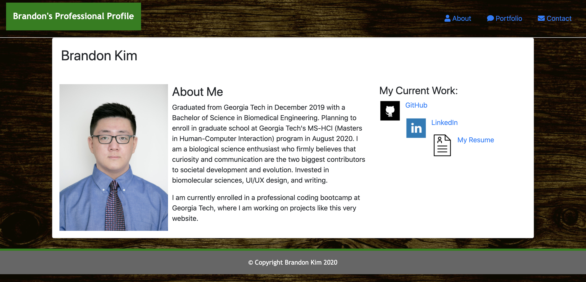

# HW20-React-Portfolio
My submission for the HW20-React-Portfolio assignment.
This is my repository for my updated portfolio page.  Contains links to my GitHub &amp; LinkedIn pages, as well as my resume and a few of my current projects.

1) Description: A deployed site displaying my portfolio of major projects I have done in the coding bootcamp so far.  Includes a brief bio about me, my GitHub and LinkedIn pages, my email and phone number, and a page containing several assignments I have submitted.

2) Link to deployed page: [insert Heroku link here]

3) Screenshot: 